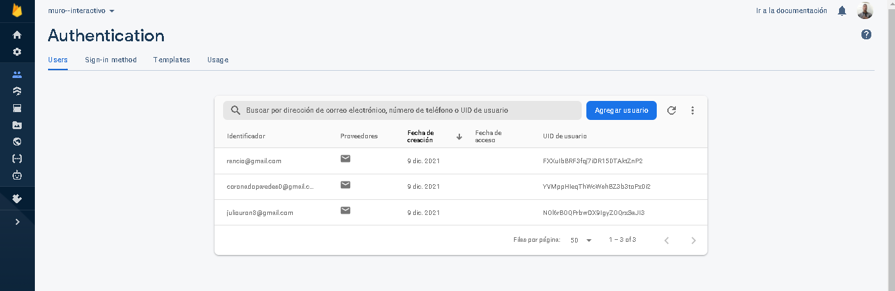
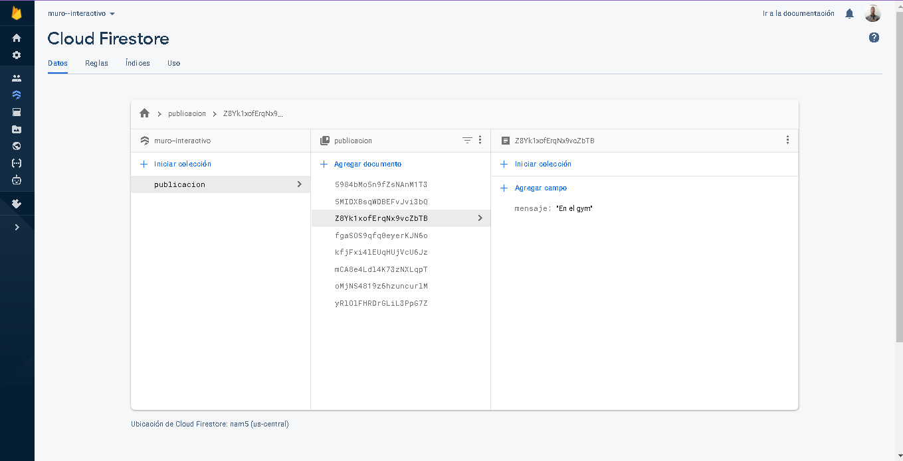
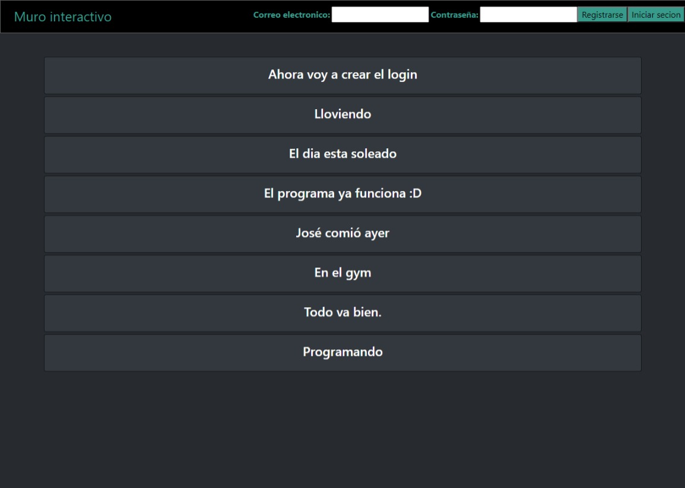

Programacion Web - proyecto final
Steven Paredes Castillo 2019-8372

Muro interactivo 

Tecnologías a Utilizar
Independientemente del tema escogido para el proyecto final se espera que se utilice javascript 
(ES6), el framework React y Firebase como tecnología para el backend.
Opción 1 (Muro Interactivo)

Haga un sistema WEB que permita a los visitantes las siguientes funcionalidades:
1. Ver todas las publicaciones hechas por todos los usuarios (No requiere autenticación)
2. Crear una cuenta de usuario (del usuario se guardará: usuario, clave nombre, apellido)
3. Iniciar Sesión
4. Publicar nuevos posts (Solo usuarios autenticados)

